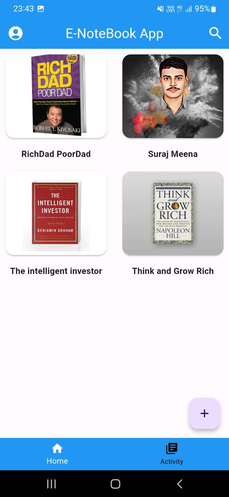
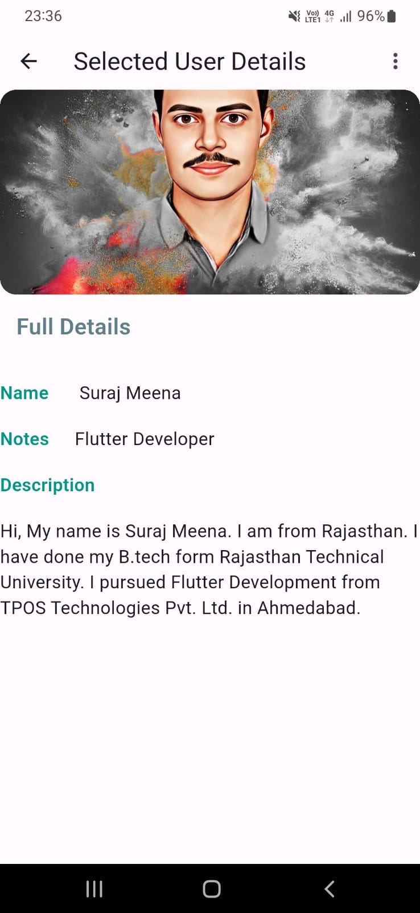
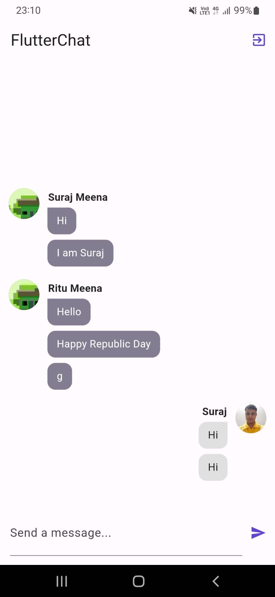

# Welcome to My Flutter Projects

This repository containing a collection of all my small projects focused on the development of the UI with Flutter. Examples:

* Dice Roller App
* Quiz App
* Chat App
* Sqflite Notes App : (Sqflite Database operations)
* FlutterWala API App : (CRUD Operations Using REST API )
* Firebase Realtime Crud App : (CRUD operations using firebase for realtime database)
* Expense Tracker App
* NumberGuessingGame
* Phonebook App : (Phone OTP Authentication)
## Get started with Flutter!

For help getting started with Flutter, view flutter online [Documentation](https://flutter.dev/)

To get up to speed quickly, start with flutter [getting started guide!](https://docs.flutter.dev/get-started/install)

If you found these projects useful, then please consider giving it a ⭐ on Github and sharing it with your friends via social media.

## 🛠 Languages and Tools:

 
 

 

## 🚀 About Me
Hi, I'm Suraj Meena! 👋
------------------------------------------------
A Passionate Flutter Developer

## 🔗 Connect with me

## Lessons Learned

What did you learn while building this project? 

✅ Flutter UI and Design Basics

✅ Firebase Connection

✅ CRUD operations for Local database 

✅ CRUD operations for Firebase database

✅ CRUD Operations Using REST API 

✅ Firebase Authentication

✅ Google Geocoding and Geolocator services

✅ In-depth knowledge on 15+ flutter packages

## ScreenShots

 |   
 
 |  
